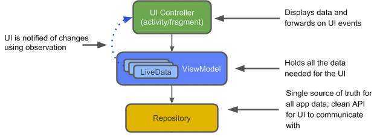
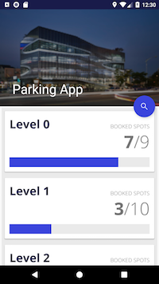
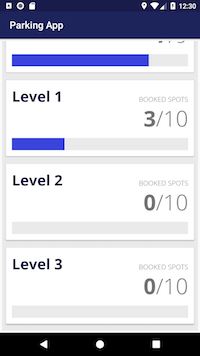
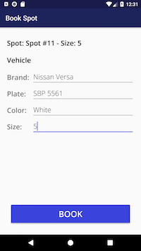

# Parking Garage Challenge

## Data Structure

The diagram was created based on the following request: 

> “My parking lot has multiple levels, and each level has multiple parking spots. We have at least 10 different sizes of parking spots. So whenever a vehicle comes in, I’d like to book it into the first level that has an available parking spot that can take the vehicle.”

  

## Application Architecture

This application was developed following the best practices established by the [Android Architecture Components](https://developer.android.com/topic/libraries/architecture/) 

* Because the content of the exercise specified that a DB was not required, the Room library included in the Android Architecture Components was not used

## Screenshots

You can try the app by [downloading the .apk directly from here](ParkingApp.apk)

  
  
  
  
  
  
  
  

## Libraries

* Android Support Libraries
* Kotlin
* Lifecycle (LiveData and ViewModel)
* Dagger 2
* Retrofit 2
* Timber

## Testing Libraries

* Mockito
* Espresso
* JUnit

## Installation Instructions

* Clone repository or download zip
* Go to Android Studio and select File > Open 
* Select the ParkingGarageChallenge folder and press Open

